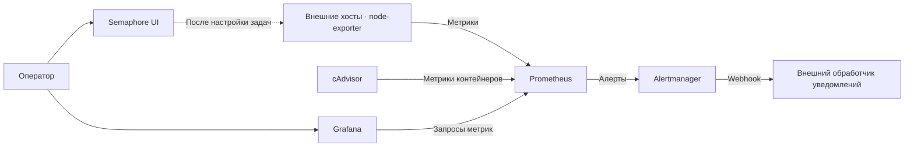

<div align="center">

# PGAAS

**Метрики, уведомления и автоматизация в одном Docker Compose стеке**

Prometheus · Alertmanager · Grafana · cAdvisor · Semaphore UI

[Быстрый старт](#быстрый-старт) · [Сервисы](#сервисы) · [Алерты](#алерты) · [Обслуживание](#обслуживание)

</div>

---

PGAAS собирает метрики контейнеров и внешних Linux-хостов, вычисляет алерты и передаёт их в сервис уведомлений. Grafana служит для визуализации, а Semaphore UI — для настройки и запуска задач автоматизации.

В репозитории находятся Compose-файл, шаблоны локальных настроек и правила алертов. Источники данных Grafana, дашборды и задачи Semaphore настраиваются после запуска.

## Как устроен стек



Prometheus также собирает собственные метрики. В шаблоне интервалы сбора и вычисления правил равны **15 секундам**, обновление списка внешних хостов — **30 секундам**.

## Сервисы

| Сервис | Назначение | Адрес при локальном запуске | Хранилище |
| --- | --- | --- | --- |
| Prometheus | Метрики и правила алертов | [localhost:9090](http://localhost:9090) | `prom_data` |
| Alertmanager | Группировка и доставка уведомлений | [localhost:9093](http://localhost:9093) | `am_data` |
| Grafana | Источники данных и дашборды | [localhost:3001](http://localhost:3001) | `grafana_data` |
| cAdvisor | Метрики контейнеров | [localhost:8081](http://localhost:8081) | — |
| Semaphore UI | Задачи автоматизации; выбран SQLite | [localhost:3000](http://localhost:3000) | `sem_data` |

Для удалённого сервера замените `localhost` на его адрес. Текущий Compose публикует порты на всех интерфейсах хоста; ограничения доступа и TLS нужно настроить в окружении развёртывания.

## Быстрый старт

### 1. Подготовьте окружение

Нужны Docker Engine с поддержкой Linux-контейнеров и Docker Compose v2 (`docker compose`). Команды ниже выполняются из корня репозитория.

Монтирования cAdvisor рассчитаны на Linux-хост с Docker. При запуске через Docker Desktop учитывайте его Linux VM: метрики нельзя автоматически считать метриками самой Windows или macOS.

Для мониторинга внешних хостов установите на них node-exporter отдельно и обеспечьте доступ к его порту из Prometheus. Сервис node-exporter в этот Compose не включён.

### 2. Создайте локальные конфиги

Выполните один из вариантов **при первой настройке**. Команды копирования могут перезаписать существующие настройки.

<details open>
<summary><strong>Linux / Bash</strong></summary>

```bash
cp .env.example .env
cp monitoring/prometheus/prometheus.yml.example monitoring/prometheus/prometheus.yml
cp monitoring/prometheus/targets/node-exporter.yml.example monitoring/prometheus/targets/node-exporter.yml
cp monitoring/alertmanager/alertmanager.yml.example monitoring/alertmanager/alertmanager.yml
```

</details>

<details>
<summary><strong>Windows / PowerShell</strong></summary>

```powershell
Copy-Item .env.example .env
Copy-Item monitoring/prometheus/prometheus.yml.example monitoring/prometheus/prometheus.yml
Copy-Item monitoring/prometheus/targets/node-exporter.yml.example monitoring/prometheus/targets/node-exporter.yml
Copy-Item monitoring/alertmanager/alertmanager.yml.example monitoring/alertmanager/alertmanager.yml
```

</details>

Эти четыре локальных файла исключены из Git. Изменения общих настроек, которые должны попасть в репозиторий, вносите также в соответствующие `.example`, без секретов.

### 3. Заполните настройки

**Учётные записи — `.env`**

| Переменная | Назначение |
| --- | --- |
| `GRAFANA_ADMIN_USER` | Логин администратора Grafana |
| `GRAFANA_ADMIN_PASSWORD` | Пароль администратора Grafana |
| `SEMAPHORE_ADMIN` | Логин администратора Semaphore |
| `SEMAPHORE_ADMIN_PASSWORD` | Пароль администратора Semaphore |
| `SEMAPHORE_ADMIN_NAME` | Имя администратора Semaphore |
| `SEMAPHORE_ADMIN_EMAIL` | Email администратора Semaphore |

Замените оба значения `CHANGE_ME` и заполните данные администратора. Эти параметры используются при первоначальной настройке; изменение `.env` не следует считать способом смены пароля уже созданной учётной записи.

**Хосты — `monitoring/prometheus/targets/node-exporter.yml`**

Замените демонстрационные адреса на доступные из Prometheus адреса ваших серверов:

```yaml
- targets:
    - "10.0.0.10:9100"
    - "10.0.0.11:9100"
  labels:
    job: "node-exporter"
```

Если внешних хостов пока нет, сохраните в этом файле пустой список `[]`.

**Уведомления — `monitoring/alertmanager/alertmanager.yml`**

В шаблоне указан адрес `http://matrix-hookshot:9000/webhook/REPLACE_ME`. Это заготовка: Matrix Hookshot не входит в Compose. Укажите доступный из Alertmanager обработчик, совместимый с форматом webhook Alertmanager; для Matrix отдельно настройте интеграцию и сетевую доступность.

Для первого запуска без доставки уведомлений можно заменить содержимое локального конфига следующим:

```yaml
route:
  receiver: local-only

receivers:
  - name: local-only
```

При такой настройке алерты будут доступны в интерфейсе Alertmanager, но внешние сообщения отправляться не будут.

### 4. Проверьте и запустите

```bash
docker compose config --quiet
docker compose up -d
docker compose ps
```

Проверка Compose проверяет конфигурацию стека, но не заменяет проверку конфигов Prometheus и Alertmanager.

Откройте [Prometheus Targets](http://localhost:9090/targets): ожидаемые цели должны иметь состояние `UP`. Правила доступны на странице [Prometheus Alerts](http://localhost:9090/alerts), поступившие алерты — в [Alertmanager](http://localhost:9093).

### 5. Подключите Grafana

Войдите в [Grafana](http://localhost:3001) с учётными данными из `.env`, добавьте источник данных типа **Prometheus** и укажите URL:

```text
http://prometheus:9090
```

Это адрес внутри сети Compose. Выполните **Save & test**, затем создайте или импортируйте подходящие дашборды. Готового provisioning в репозитории пока нет.

[Semaphore UI](http://localhost:3000) настраивается отдельно: после входа создайте проект, добавьте необходимые репозитории, учётные данные, inventory и шаблоны задач.

## Алерты

Prometheus загружает оба файла из `monitoring/rules/`.

| Правило | Условие | Удержание условия (`for`) | Severity |
| --- | --- | --- | --- |
| `HostDown` | Недоступен настроенный node-exporter | 2 мин | `critical` |
| `HostHighCPU` | CPU > 90% | 10 мин | `warning` |
| `HostCpuUsageCritical` | CPU > 97% | 5 мин | `warning` |
| `HostDiskUsageCritical` | Занято > 98% по доступному месту; ФС не read-only | 5 мин | `warning` |
| `HostMemoryUsageCritical` | Использовано > 95% по `MemAvailable` | 5 мин | `warning` |
| `HostNetworkUsageCritical` | `(RX + TX) / speed` > 95% | 5 мин | `warning` |

CPU и сетевые скорости рассчитываются по окну 5 минут. Дисковое правило исключает часть временных ФС и путей, сетевое — loopback и ряд виртуальных интерфейсов; точные фильтры находятся в [host-alerts.yml](monitoring/rules/host-alerts.yml).

Два CPU-правила могут сработать одновременно. Суффикс `Critical` сейчас не совпадает с фактическим `severity: warning`. Сетевая формула суммирует приём и передачу, поэтому для full-duplex интерфейсов её результат не равен загрузке одного направления.

В шаблоне Alertmanager уведомления группируются по `alertname`, `job` и `instance`: начальная задержка — 10 секунд, интервал обновления группы — 5 минут, повтор — 2 часа. Для webhook включена отправка сообщений о разрешении алерта.

## Обслуживание

| Действие | Команда |
| --- | --- |
| Статус контейнеров | `docker compose ps` |
| Последние логи | `docker compose logs --tail=100` |
| Следить за логами Prometheus | `docker compose logs -f prometheus` |
| Перезапустить Prometheus после изменения конфига или правил | `docker compose restart prometheus` |
| Перезапустить Alertmanager после изменения конфига | `docker compose restart alertmanager` |
| Применить изменения Compose или переменных окружения | `docker compose up -d` |
| Остановить стек | `docker compose down` |

Изменения списка node-exporter подхватываются автоматически, согласно `refresh_interval: 30s`.

Данные сервисов размещены в именованных Docker volumes. Обычный `docker compose down` сохраняет их; добавление `-v` удаляет volumes вместе с данными. Резервное копирование в репозитории не настроено.

Все образы сейчас используют тег `latest`. Для воспроизводимых развёртываний зафиксируйте проверенные версии или digest перед обновлением стека.

## Если что-то не работает

| Симптом | Что проверить |
| --- | --- |
| Compose сообщает, что `.env` не найден | Созданы ли локальные файлы из шага 2; запускается ли команда из корня репозитория |
| Prometheus или Alertmanager не стартует | Существуют ли рабочие `.yml` именно как файлы; что показывают логи сервиса |
| Цель node-exporter имеет статус `DOWN` | Адрес и порт, работа exporter, доступность хоста из сети Prometheus |
| Grafana не получает метрики | Источник данных должен обращаться к `http://prometheus:9090` |
| Алерт виден, но уведомление не приходит | URL webhook, совместимость обработчика, его доступность и логи Alertmanager |
| Порт занят | Измените левую часть соответствующего сопоставления `ports` в Compose |

## Структура репозитория

```text
.
├── docker-compose.yml
├── .env.example
├── .gitignore
├── README.md
└── monitoring/
    ├── alertmanager/
    │   └── alertmanager.yml.example
    ├── prometheus/
    │   ├── prometheus.yml.example
    │   └── targets/
    │       └── node-exporter.yml.example
    └── rules/
        ├── basic.yml
        └── host-alerts.yml
```

## Документация компонентов

[Docker Compose](https://docs.docker.com/compose/) · [Prometheus](https://prometheus.io/docs/introduction/overview/) · [Alertmanager webhook](https://prometheus.io/docs/alerting/latest/configuration/#webhook_config) · [Grafana](https://grafana.com/docs/grafana/latest/) · [cAdvisor](https://github.com/google/cadvisor) · [Semaphore UI](https://docs.semaphoreui.com/)
